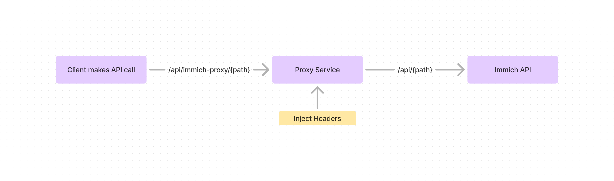

# Contributing to Immich Power Tools

The code is pretty straight forward and easy to understand. Please just make sure you follow the below guidelines so that its easy for me to review and merge your PR.

### Structure

- `components` - All the UI components
- `config` - All the configuration files and constants
  - `config/routes.ts` - All the routes for the application
- `helpers` - All the helper functions for both data and modules
- `lib` - All the utility functions
- `pages` - All the pages based on [Next.js](https://nextjs.org/)'s page based routing
- `styles` - All the global styles (We don't touch this much as we are using Tailwind CSS)
- `types` - All the typescript types and interfaces (Make sure you create `.d.ts` files for each module)

### API Infrastructure

Since Immich API needs to send auth token in the headers, I've created a proxy api that matches the Immich's APIs path to forward the request to Immich's API with it's token (Which is stored in the `.env` file). This is done to avoid CORS issues and Security issues.

You can find the API route here `pages/api/immich-proxy/[...path].ts`

### Thubmnails

Since the `thumbnailPath` of Immich API doesnt give us a direct link to the image, I've created a proxy api that fetches the image and sends it back as a response. 

**For Person's Thumbnail**
You can find the API route here `pages/api/immich-proxy/thumbnail/[id].ts`