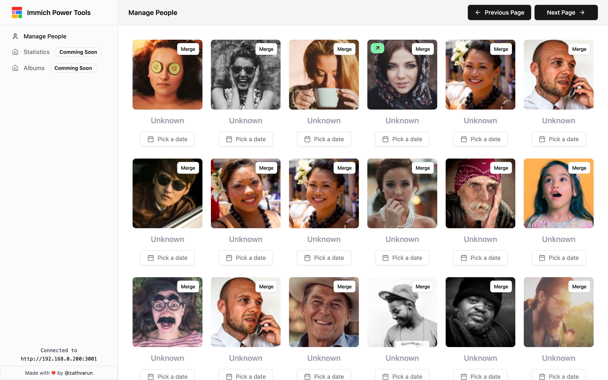

#  Immich Power Tools

A unofficial immich client to provide better tools to organize and manage your immich account. Building it to speed up your workflows in Immich to organize your people and albums.


[Watch Demo Video here](https://www.loom.com/embed/13aa90d8ab2e4acab0993bdc8703a750?sid=71498690-b745-473f-b239-a7bdbe6efc21)

[](https://www.loom.com/embed/13aa90d8ab2e4acab0993bdc8703a750?sid=71498690-b745-473f-b239-a7bdbe6efc21)


### 💭 Back story

Recently I've migrated my entire Google photos library to Immich, I was able to successfully migrate all my assets along with its albums to immich. But there were few things like people match that was lacking. I loved Immich UI on the whole but for organizing content I felt its quite restricted and I had to do a lot of things in bulk instead of opening each asset and doing it. Hence I built this tool (continuing to itereate) to make my life and any other Immich user's life easier.


### 🚀 Getting Started 

#### 🐬 Using Docker

You can run the project using `Dockerfile` and `docker-compose.yml` file.

```bash
docker compose up -d
```

#### 🚀 Using Local Setup

> [!NOTE]  
> Please use `bun` to run the project. If you don't have `bun` installed, checkout [bun.sh](https://bun.sh/) for installation.

Copy paste the `.env.example` to `.env` and fill in the values.

```bash
NEXT_PUBLIC_IMMICH_URL="" # Immich API URL
IMMICH_API_KEY="" # Immich API Key 
DATABASE_URL="" # Postgress Database URL
```

Refer here for obtaining Immich API Key: https://immich.app/docs/features/command-line-interface#obtain-the-api-key

Run the development server:

```bash
bun run dev
```


### Features

**Immich Related**

- [x] Manage People 
- [ ] Manage Albums
- [ ] Statistics

**Tech Related**

- [ ] Dark Mode
- [ ] Dockerize
- [ ] Authentication

### Tech Stack

- [Next.js](https://nextjs.org/) for infrastructure
- [Tailwind CSS](https://tailwindcss.com/) for styling
- [Shadcn](https://shadcn.com/) for UI Components
- [Axios](https://axios-http.com/) for API calls

### Contributing

Feel free to contribute to this project, I'm open to any suggestions and improvements. Please read the [CONTRIBUTING.md](./CONTRIBUTING.md) for more details.