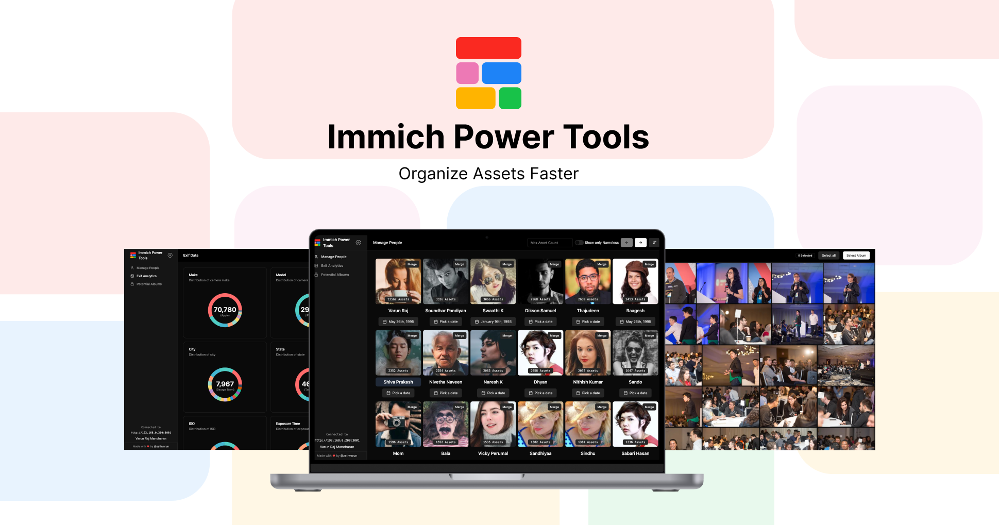

#  Immich Power Tools

A unofficial immich client to provide better tools to organize and manage your immich account. Building it to speed up your workflows in Immich to organize your people and albums.

[Watch Demo Video here](https://www.loom.com/embed/13aa90d8ab2e4acab0993bdc8703a750?sid=71498690-b745-473f-b239-a7bdbe6efc21)

[](https://www.loom.com/embed/13aa90d8ab2e4acab0993bdc8703a750?sid=71498690-b745-473f-b239-a7bdbe6efc21)

## 💭 Back story

Recently I've migrated my entire Google photos library to Immich, I was able to successfully migrate all my assets along with its albums to immich. But there were few things like people match that was lacking. I loved Immich UI on the whole but for organizing content I felt its quite restricted and I had to do a lot of things in bulk instead of opening each asset and doing it. Hence I built this tool (continuing to itereate) to make my life and any other Immich user's life easier.

## 🚀 Getting Started

### 🐬 Using Docker

#### Power-tools is designed to be used alongside Immich, and there are two ways you can run it.
#### Method 1 - Docker Compose ( Recommended )

Add the following into your docker compose as a new service along side other immich services. Make sure you've `power-tools` in same network as immich.

See the sample [docker-compose-all-immich.yml](./docker-compose-all-immich.yml) file for reference.

```yaml
services:
  # Other services...
  power-tools:
    container_name: immich_power_tools
    image: ghcr.io/varun-raj/immich-power-tools:latest
    ports:
      - "8001:3000"
    env_file:
      - .env
```

Add the Immich API Key and immich url's to the env file (which you already have for the immich)

```bash
IMMICH_API_KEY= # your_immich_api_key
IMMICH_URL = "http://local-ip-of-immich:port" # Your immich instace ip address and port
EXTERNAL_IMMICH_URL = "https://external-address" # External address of immich

# Optional
GOOGLE_MAPS_API_KEY= # Google Maps API Key
GEMINI_API_KEY= # Gemini API Key
```
Refer here for obtaining Immich API Key: https://immich.app/docs/features/command-line-interface#obtain-the-api-key

#### Method 2 - Portainer

If you're using portainer, run the docker using `docker run` and add the power tools to the same network as immich.

```bash
docker run -d --name immich_power_tools -p 8001:3000 --env-file .env ghcr.io/varun-raj/immich-power-tools:latest
```


### 🚀 For local development

> [!NOTE]  
> Please use `bun` to run the project. If you don't have `bun` installed, checkout [bun.sh](https://bun.sh/) for installation.


Copy paste the `.env.example` to `.env` and fill in the values.

```bash
  IMMICH_URL="" # Immich URL
  IMMICH_API_KEY="" # Immich API Key
  DB_USERNAME="" # Postgress Database Username
  DB_PASSWORD = "" # Postgres Database Password
  DB_HOST = "" # Postgres Host (IP address or hostname of the database)
  DB_PORT = "" # Postgres Port number (Default: 5432)
  DB_DATABASE_NAME = "" # Name of the database 
```
> [!NOTE]  
> Make sure you have postgres port exposed on you machine.

Refer here for obtaining Immich API Key: https://immich.app/docs/features/command-line-interface#obtain-the-api-key

Run the development server:

```bash
bun run dev
```

## Features

**Immich Related**

- [x] Manage People
  - [x] Smart Merge
- [x] Manage Albums
  - [ ] Bulk Delete
  - [ ] Bulk Edit
  - [ ] Filters
  - [x] Potential Albums
  - [x] People in Album
- [x] Missing Location
- [x] Statistics
  - [x] EXIF Data
  - [x] Assets Overtime Chart

**Tech Related**

- [x] Dark Mode
- [x] Dockerize
- [x] Authentication
- [x] Push to github packages

## Tech Stack

- [Next.js](https://nextjs.org/) for infrastructure
- [Tailwind CSS](https://tailwindcss.com/) for styling
- [Shadcn](https://shadcn.com/) for UI Components
- [Axios](https://axios-http.com/) for API calls

## External Services
These services are completely optional and you can use the tool without them. Just that they are used for some of the features. But we dont send any personal data to these services.

- [Google Maps](https://maps.google.com/) for heatmap
Google Maps Javascript API Key is used to render the maps layer for heatmap. When rendering the heatmap, we only send the location data to Google Maps and not any other data.

  > Code where heatmap data is plotted: [src/pages/assets/geo-heatmap.tsx:32](./src/pages/assets/geo-heatmap.tsx#L32-L35)

- [Gemini](https://gemini.google.com/) for rewind video generation
Google Gemini 1.5 Flash model is used for parsing your search query in "Find" page. We do not send any personal data to Gemini, only data that is sent to Gemini is your search query and rest of the querying happes using [Immich's Smart Search API](https://immich.app/docs/api/search-smart)

  > Code where Gemini is used: [src/helpers/gemini.helper.ts](./src/helpers/gemini.helper.ts)


## Contributing

Feel free to contribute to this project, I'm open to any suggestions and improvements. Please read the [CONTRIBUTING.md](./CONTRIBUTING.md) for more details.